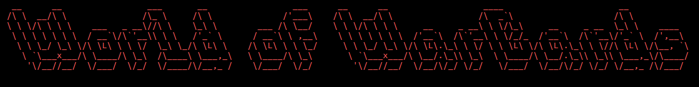

# World of WarCards



>Proyecto de Programación II. Facultad de Matemática y Computación Universidad de La Habana. Curso 2022. Autores: Daniel Toledo, Osvaldo Moreno, José Antonio Concepción.

## Acerca del juego

World of WarCards es un juego de cartas por turnos. El objetivo es debilitar al rival con los efectos de las cartas escogidas. Cada jugador tiene una energía y una voluntad máxima a utilizar en cada turno. Cada carta consume una cantidad de energía específica y una unidad de voluntad. Cuando una carta se activa no podrá ser reutlizada hasta que ocurra un número espicificado de acciones (Cooldown). El jugador será el encargado de, dadas sus cartas, determinar una estrategia ganadora en cada juego.

## Introducción al uso de la consola

La aplicación de consola esta compuesta por 3 secciones:

- **`Jugar`**
- **`Opciones`**
- **`Créditos`**

Una vez seleccionada la opción **Jugar** desde el menú interactivo, usted deberá introducir los datos de los jugadores y escoger las cartas con las que jugará cada uno. En el menú de batalla, en la sección superior podrá apreciar las estadísticas de los jugadores, y el log del juego (Turno del player y acciones que ocurren). En la sección inferior se encuentran las cartas escogidas y un menú de acciones que se pueden  realizar, utilice las flechas izquierda y derecha para moverse a través de las cartas disponibles, y los números mostrados delante del nombre de cada acción, para realizar la misma. En la sección de **Opciones** podrá ver todas las cartas disponibles en el juego con su descripción. Además, podrá realizar un simulación de un juego entre jugadores virtuales de su elección.

Las clases del manejo de la interfaz virtual se encuentran dentro de la carpeta Console. Se recomienda al usuario usar una consola totalmente expandida para que pueda disfrutar de una mejor experiencia de juego.

## Sobre la creación de cartas

### Introducción a la creación de cartas

El juego es totalmente configurable, los jugadores pueden acceder a [*code.txt*](Program/code.txt) para crear y modificar las cartas disponibles (para evitar errores, se tomó la decisión de ser insensible a mayúsculas y minúsculas). Para ello cuentan con un conjunto de piezas que debe usar. Por lo que traemos una breve explicación de cada una de ellas.
Cada pieza esta representada por una palabra clave que el usuario debe introduccir para hacer su uso. Las piezas son:

- `Poderes`: Estas recogen los poderes más simples a partir de los cuales el usario podra componer y crear sus poderes. Podra ver los poderes detalladamente el uso de cada uno de ellos en [Manual de Poderes](ManualPoderes.md).
  
- `Objetivos`: Los objetivos son piezas que se encargan de determinar a quién irá dirigdo un poder. Por ejemplo, si el poder es de daño, el objetivo determina a quien se le aplicará el daño. Los objetivos se pueden ver detalladamente en [Manual de Objetivos](ManualObjetivos.md).

Con estas piezas el usuario es capáz de crear un estructura superior y más compleja, los `Efectos`. Los efectos son piezas que se encargan de combinar los poderes y los objetivos para crear un efecto completo.
Los efectos no usan palabras claves, comienzan con un corchete `[` y terminan con otro `]`. Dentro de los corchetes el usuario introduce los poderes que desee, luego un punto y coma `;` y los objetivos que desee. Luciendo asi `[objetivos;poderes]`. A continuación se muestran algunos ejemplos practicos de efectos:

```c++
[next(); modifyhealth(-1)] //daño al siguiente jugador

[next(), self(); modifyhealth(-1.2), modifyenergy(-1)] //daño y consumo de energia al siguiente jugador y a si mismo 
```

>Notese que el grupo de poderes se separa por comas ',' , al igual que los objetivos

Se pueden crear además Efectos con `Condiciones` que se encargan de determinar si un efecto se ejecuta o no. Para crear un efecto con condiciones se debe usar la palabra clave `if` seguida de una condición y un efecto. Por ejemplo:

```c++
if( 5 + 5 > 0 ) [self(); modifyhealth(-1)] //si 5 + 5 es mayor a 0, se ejecuta el efecto
```

Los Efectos con Condiciones permiten que luego de poner un efecto se pueda poner otro efecto que se ejecutará si la condición no se cumple. Para esto se usa la palabra clave `else` seguida de un efecto. Por ejemplo:

```c++
if( 5 + 5 > 0 ) [self(); modifyhealth(-1)] else [self(); modifyhealth(1)] //si 5 + 5 es mayor a 0, se ejecuta el efecto de daño, si no, se ejecuta el efecto de curación
```

Y además se pueden crear Efectos con Condiciones anidadas. Por ejemplo:

```c++
if( 5 + 5 > 0 ) [self(); modifyhealth(-1)] 
else if( 5 + 5 < 0 ) [self(); modifyhealth(1)] 
else if ( true && false) [self(); modifyhealth(2)] 
else [self(); modifyhealth(3)]
//si 5 + 5 es mayor a 0, se ejecuta el efecto de daño, si no, si 5 + 5 es menor a 0, se ejecuta el efecto de curación, si no, si true y false es verdadero, se ejecuta el efecto de curación de 2, si no, se ejecuta el efecto de curación de 3
```

El usuario también puede usar variables para guardar efectos y usarlos luego. Para crear una variable se usa la palabra clave `Effect` seguida del nombre de la variable, el caracter ¨=¨ un efecto. Por ejemplo:

```c++
 Effect lightning = [next(); modifyhealth(-1.2)] //crea una variable llamada lightning que guarda el efecto de daño al siguiente jugador
```

>Los nombres de variables no pueden empezar con números y ni contener espacios. Solo caracteres alfanuméricos y el caracter `_` son permitidos.

Por su gran complejidad hemos dejado los `Estados` para el final. Los estados son parte de la familia de los poderes, y son tratados como tal, se encargan de aplicar un efecto en alguna de las fases del juego. El juego consta de tres fases: `Inicio de turno`, `Jugada de carta` y `Fin del turno`. Los estados se pueden usar en cualquiera de estas fases. Para usar un estado se debe usar la palabra clave de la fase en la que se quiera usar, luego un Efecto y una expresión que determina la duración del estado.
Las palabras claves de los estados son `initstate`, `playcard`, `endstate`. En el siguiente ejemplo se muestra como usar un estado en la fase de `Jugada de carta`, en un efecto:

```c++
Effect Aura_de_Represión = [self(); playcard (next(); modifyhealth(-1.5); 2)];
//crea una variable llamada Aura_de_Represión que guarda el efecto de daño al siguiente jugador, en la fase de jugada de carta del jugador actual, con una duración de 2 turnos
```

> Notese que el estado se usa dentro de un efecto, por ser un poder.

### Creación de Cartas

Crear una carta es bastante sencillo, se debe usar la palabra clave `Card` seguida del nombre de la carta,
luego un primer valor que determina el tiempo de reutilización de la carta, un segundo valor que determina el costo de la carta, luego dos llaves `{` y `}` y dentro de las llaves se ponen los efectos de la carta. Por ejemplo:

```c++
Card Fireball 1 2 
{ 
    [next(); modifyhealth(-1.2)] 
} //crea una carta llamada Ataque_de_Fuego con un tiempo de reutilización de 1 turnos, un costo de 2, y un efecto de daño al siguiente jugador

Effect lightning = [next(); modifyhealth(-1.2)] //crea una variable llamada lightning que guarda el efecto de daño al siguiente jugador

Card lightning 1 1 
{ 
    [next(); modifyhealth(-1.2)] 
    lightning 
} //crea una carta llamada Lightning con un tiempo de reutilización de 1 turnos, un costo de 1, y un efecto de daño al siguiente jugador
```

> Una carta y un efecto pueden tener nombres iguales, pero no es recomendable


## Sobre el código
